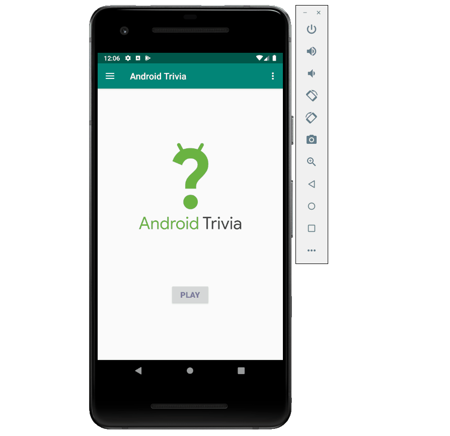

# Android Trivia

An Android application that allows you to play a trivia game.

Submitted by: Yusley Rosabal Espinosa

Time spent: 6h

## User Stories

The following **required** functionality is complete:

* [X] Implement multiple screens using fragments.
* [X] Add navigation and conditional navigation between fragments.
* [X] Add support for the Up Button.
* [X] Add a menu.
* [X] Add public sharing of trivia results with an Intent.
* [X] Add a navigation drawer.
* [X] Disable drawer swiping using navigation listener.
* [X] Add animations.

The following **additional** features are implemented:

* [X] Add new questions to the trivia game.
* [X] Add new animations.

## Video Walkthrough 

Here's a walkthrough of implemented user stories:

## Notes

Describe any challenges encountered while building the app.

## License

Copyright 2019 Yusley Rosabal Espinosa

Licensed under the Apache License, Version 2.0 (the "License");
you may not use this file except in compliance with the License.
You may obtain a copy of the License at

http://www.apache.org/licenses/LICENSE-2.0

Unless required by applicable law or agreed to in writing, software
distributed under the License is distributed on an "AS IS" BASIS,
WITHOUT WARRANTIES OR CONDITIONS OF ANY KIND, either express or implied.
See the License for the specific language governing permissions and
limitations under the License.
